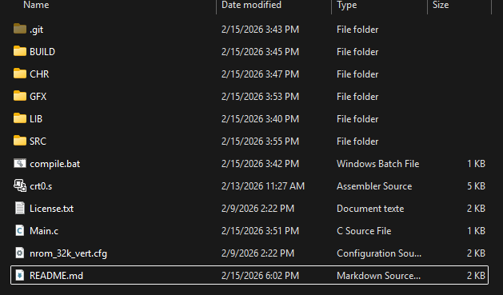

<p align="Center"></p>
<h4 align="Center">0SH - Gestion de projet (2026)</h4>

<h2 align="center">[CUCCO ATTACK]</h2>

# Plan de projet "CuccoAttack" :chicken:
---
### Introduction
Le projet **CuccoAttack** consiste à créer un jeu vidéo fidèle à la **NES** (**N**intendo **E**ntertainement **S**ystem), la console emblématique des années 80. La jeu sera programmé principalement en C grâce à un compileur, [cc65](https://cc65.github.io/). Quelques librairies seront utilisées afin de simplifier la communication avec les composantes de la NES, comme [neslib](https://github.com/clbr/neslib) et [nesdoug](https://nesdoug.com/). NesDoug est d'ailleurs l'auteur d'excellents guides sur la programmation C de jeux NES et SNES.
### Concepts clés
- Le jeu sera de type *sidescroller* (vue de côté, comme Castlevania, Ninja Gaiden, Zelda II, etc.)
- le personnage principal sera affecté par la gravité, et disposera d'une inertie et d'une accélération afin de rendre ses mouvements plus réalistes.
- à compléter au fur et à mesure...

---

# :chicken: Guide pour la programmation :chicken:
### programmes utiles:
- [cc65](https://cc65.github.io/), le compiler pour la NES
- [NEXXT](https://frankengraphics.itch.io/nexxt), éditeur de tiles, palettes, tileset, metasprites, et pleins d'autres choses utiles
- [yychr](https://w.atwiki.jp/yychr/), CHR editor (tileset), peut être plus intuitif pour Milanne (attention, télécharge la bonne version sinon l'application sera en japonais :skull:)
- [Bizhawk](https://tasvideos.org/Bizhawk), un émulateur pour la NES. Il supporte plusieurs manettes modernes, mais j'ai déjà eu des problèmes avec les changements de banks (par un problèmes pour notre projet)
> Je vous fournirai un dossier avec tous les programmes compressés.

### Structure des fichiers et explications:


BUILD
: fichier compilé par cc65 ainsi que le code source en assembleur

CHR
: tileset du jeu (Toute des sprites et autres données graphiques)
En voici un exemple :


GFX
: Code pour les textures du jeu, voici un example:
```c
const unsigned char boy_Metasprite0_data[]={

    0, -16, 0xe0, 0,
    8, -16, 0xe1, 0,
    0, - 8, 0xda, 0,
    8, - 8, 0xdb, 0,
  0x80
  };
```
Ici notre personnage principal, "boy", est composé de 4 sprites différents, formant un "Metasprite". Si on prend la première ligne de code, `0, -16, 0xe0, 0,` 0 et -16 indiques les coordonnées x et y du premier sprite, 0xe0 indique l'adresse mémoire du sprite (sa position dans le tileset) et finalement 0 dit au Metasprite d'utiliser la palette de couleurs 0, définie séparément.

LIB
: Là où on met nos librairies. Contrairement à ce que nous avions fait en  c++ et arduino, ici nous n'avons pas de Library manager. Il faut les trouver sur le web et les télécharger manuellement. nesdoug.h et neslib.h sont des libraires codées en assembleur pour faciliter la programmation de jeux NES en C.

SRC
: Là où on place nos headers. Puisqu'il n'y a pas de classes en C, l'utilisation des header est très importante.

compile.bat
: Mon fichier batch qui exécute le code de cc65 et compile notre code c en un fichier .nes

crt0.s
: le "startup code" pour cc65. C'est ici qu'on peut dire à cc65 quel fichiers compiler.

Main.c
: Fichier c principal du jeu

nrom_32k_vert.cfg
: Configuration des adresses mémoires de la NES. Pas touche sinon tout pète!

<hr><p align="Center"></p>